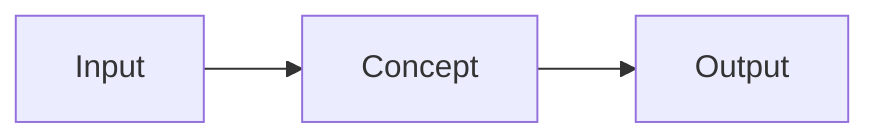

# Concept Name

<!-- toc:start -->
<!-- toc:end -->

Use this as an output-page starter when it helps. Do not require source notes to follow this shape.

## Why it matters

## Mental model

## Practical usage

## Example

## Diagram

## Common pitfalls

## Related notes

## Official references
