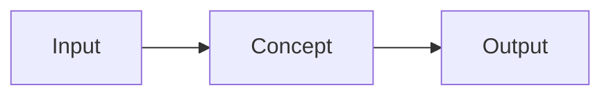

# Concept Name

<!-- toc:start -->
<!-- toc:end -->

## Why it matters

## Mental model

## Practical usage

## Example

## Diagram

```mermaid
flowchart LR
    A[Input] --> B[Concept]
    B --> C[Output]
```

## Common pitfalls

## Related notes

## Official references
