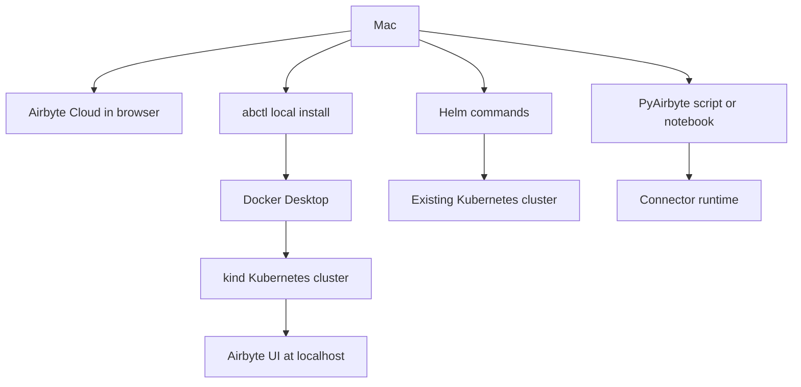

# Running Airbyte from a Mac

<!-- toc:start -->
- [Why it matters](#why-it-matters)
- [Decision guide](#decision-guide)
- [Mental model](#mental-model)
- [Recommended local path: abctl](#recommended-local-path-abctl)
- [Kubernetes path: Helm](#kubernetes-path-helm)
- [No-server path: PyAirbyte](#no-server-path-pyairbyte)
- [Cloud path](#cloud-path)
- [Mac-specific pitfalls](#mac-specific-pitfalls)
- [Related notes](#related-notes)
- [Official references](#official-references)
<!-- toc:end -->

## Why it matters

Airbyte can mean several different workflows from a Mac. Sometimes you want to open a managed Airbyte Cloud workspace in a browser. Sometimes you want a local self-managed Airbyte Core instance for learning. Sometimes you only need a Python process that can run Airbyte connectors without standing up the full platform.

The best choice depends on whether you need the Airbyte web app and scheduler, whether data can leave your local network, and how much local infrastructure you want to manage.

## Decision guide

| Goal | Best fit | What runs from the Mac | Remember |
| --- | --- | --- | --- |
| Try the full Airbyte UI locally | Airbyte Core with `abctl` | Docker Desktop, a `kind` Kubernetes cluster, and Airbyte services | This is the default local self-managed path. |
| Use Airbyte without local infrastructure | Airbyte Cloud | Browser and API clients | Airbyte manages the platform; check pricing, regions, and data handling. |
| Practice Kubernetes-style deployment | Helm chart on a Kubernetes cluster | A local or remote Kubernetes cluster plus Helm | Use this when you already want to learn or control Kubernetes. |
| Move data from Python or a notebook | PyAirbyte | Python process, connector runtime, and optional Docker | This is not the full Airbyte server or scheduler. |
| Follow old Docker Compose tutorials | Do not start here | Unsupported legacy deployment path | Current Airbyte docs say Docker Compose deployments are no longer supported. |

## Mental model



## Recommended local path: abctl

Use `abctl` when you want the full self-managed Airbyte Core experience on your Mac without manually building a Kubernetes cluster. Airbyte runs on Kubernetes, and `abctl` creates and manages its own `kind` cluster inside Docker.

Prerequisites:

- Install Docker Desktop for Mac and keep it running.
- Plan on 4 or more CPUs and at least 8 GB of memory for best performance. Airbyte documents a low-resource mode for machines with fewer than 4 CPUs, but low-resource mode disables Connector Builder.
- Install `abctl`.

On a Mac, Homebrew is the easiest install path to remember:

```bash
brew tap airbytehq/tap
brew install abctl
abctl version
```

Start Airbyte locally:

```bash
abctl local install
abctl local status
abctl local credentials
```

After installation, Airbyte should be available at `http://localhost:8000` unless you chose another host or port. Use `abctl local credentials` to retrieve the generated email, password, client ID, and client secret for the local instance.

Useful variations:

```bash
# Use this when the Mac has fewer than 4 CPUs available to Docker.
abctl local install --low-resource-mode

# Use this when port 8000 is already taken.
abctl local install --port 9000

# Stop containers while preserving Airbyte data for a later reinstall.
abctl local uninstall
```

## Kubernetes path: Helm

Use Helm when you already have a Kubernetes cluster or you specifically want to practice a deployment shape that is closer to production. On a Mac, the cluster might come from Docker Desktop Kubernetes, `kind`, `k3s`, or Colima. Airbyte's deployment guide is written for a cluster that already exists.

The basic flow is:

```bash
helm repo add airbyte https://airbytehq.github.io/charts
helm repo update
kubectl create namespace airbyte
helm search repo airbyte --versions
```

Then install a chart version that matches the Airbyte platform version you want:

```bash
helm install airbyte airbyte/airbyte \
  --namespace airbyte \
  --values ./values.yaml \
  --version <chart-version>
```

For local UI access, port-forward the server deployment:

```bash
kubectl -n airbyte port-forward deployment/airbyte-server 8080:8001
```

Then open `http://127.0.0.1:8080`.

Choose this path when the learning goal is Kubernetes, Helm values, ingress, external databases, object storage, or secret management. For a quick local Airbyte trial, `abctl` is simpler.

## No-server path: PyAirbyte

Use PyAirbyte when you want connector-powered data extraction in Python without running the Airbyte platform. This is useful for notebooks, small prototypes, and scripts where you do not need the Airbyte UI, scheduler, workspace model, or server API.

Install it in a Python environment:

```bash
pip install airbyte
```

Small example:

```python
import airbyte as ab

source = ab.get_source(
    "source-faker",
    config={"count": 100},
    install_if_missing=True,
)
source.check()
source.select_all_streams()
result = source.read()

for stream_name, records in result.streams.items():
    print(stream_name, len(list(records)))
```

PyAirbyte connector execution depends on connector metadata. Depending on the connector, it may use a declarative source manifest, a PyPI package, or a Docker image when Docker is available.

## Cloud path

Use Airbyte Cloud when the goal is to evaluate or operate Airbyte without local Docker and Kubernetes. From the Mac, you work through the browser, API, SDKs, Terraform provider, or other clients while Airbyte manages the platform infrastructure.

This is often the fastest path for a realistic data movement test, but it changes the questions you should ask:

- Which plan and trial limits apply?
- Which data residency region should the workspace use?
- Are the source and destination credentials allowed to be stored in a managed service?
- Does the connector need network access to private systems that are only reachable from your Mac or internal network?

## Mac-specific pitfalls

- Keep Docker Desktop running before starting or returning to a local `abctl` instance.
- Increase Docker Desktop CPU, memory, and disk allocation if Airbyte startup or sync jobs are slow.
- If a local file destination writes through `/tmp/airbyte_local`, make sure Docker Desktop can share `/tmp` and `/private` on macOS, because `/tmp` is a symlink into `/private`.
- Do not use Docker Compose for a new Airbyte deployment. Airbyte's current docs state that Docker Compose deployments are no longer supported, and the old `abctl --migrate` flow has been removed.
- Do not point `abctl` at an existing Kubernetes cluster. `abctl` manages its own `kind` cluster; use the Helm deployment guide when you already have Kubernetes.

## Related notes

- [Airbyte notes](README.md)
- [Glossary: Airbyte](../glossary.md#airbyte)
- [Glossary: Connector](../glossary.md#connector)

## Official references

- [Airbyte docs: Data replication platform](https://docs.airbyte.com/platform)
- [Airbyte docs: Quickstart for local Airbyte Core](https://docs.airbyte.com/platform/using-airbyte/getting-started/oss-quickstart)
- [Airbyte docs: `abctl`](https://docs.airbyte.com/platform/deploying-airbyte/abctl)
- [Airbyte docs: Deploy Airbyte with Helm](https://docs.airbyte.com/platform/deploying-airbyte)
- [Airbyte docs: Migrating from Docker Compose](https://docs.airbyte.com/platform/deploying-airbyte/migrating-from-docker-compose)
- [Airbyte docs: PyAirbyte](https://docs.airbyte.com/developers/pyairbyte)
- [Docker docs: Install Docker Desktop on Mac](https://docs.docker.com/desktop/setup/install/mac-install/)
- [Docker docs: Docker Desktop resource and file sharing settings](https://docs.docker.com/desktop/settings-and-maintenance/settings/)
