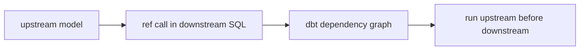

# `ref()` and Model Dependencies

<!-- toc:start -->
- [Why it matters](#why-it-matters)
- [Mental model](#mental-model)
- [Small example](#small-example)
- [Common pitfalls](#common-pitfalls)
- [Related notes](#related-notes)
- [Official references](#official-references)
<!-- toc:end -->

## Why it matters

`ref()` is the main way a dbt model points to another dbt resource. Instead of hard-coding a database and schema name, a model uses `{{ ref('model_name') }}` so dbt can resolve the relation and understand that the current model depends on the referenced model.

For review, the key idea is: `ref()` does not create a table by itself. It declares a dependency and compiles to the referenced relation name. During commands such as `dbt run` or `dbt build`, dbt uses the dependency graph to run upstream models before downstream models when both are selected.

## Mental model



## Small example

```sql
-- models/orders_enriched.sql
select
    o.order_id,
    c.customer_name
from {{ ref('stg_orders') }} as o
left join {{ ref('stg_customers') }} as c
    on o.customer_id = c.customer_id
```

This tells dbt that `orders_enriched` depends on both `stg_orders` and `stg_customers`.

## Common pitfalls

- Do not describe `ref()` as a SQL foreign-key reference. It is a dbt/Jinja function that resolves a dbt resource relation and records graph dependencies.
- Do not say that `ref()` always creates the upstream table. The materialization and selected command determine what dbt builds.
- Be careful with conditional Jinja. If a `ref()` is hidden from dbt's parse phase, dbt may not infer the dependency unless it is made visible in a SQL comment pattern supported by dbt.

## Related notes

- [dbt notes](../README.md)
- [Sources and `source()`](../sources/source.md)
- [Glossary: DAG](../../glossary.md#dag)

## Official references

- [dbt docs: `ref()` function](https://docs.getdbt.com/reference/dbt-jinja-functions/ref)
