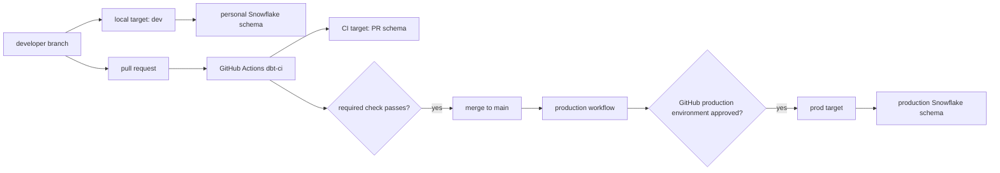
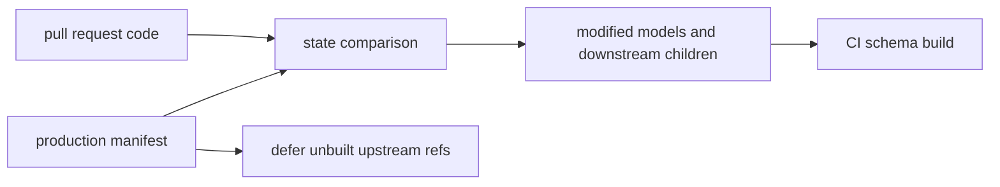

# dbt Profiles, Environments, and CI Promotion

<!-- toc:start -->
- [Why it matters](#why-it-matters)
- [Mental model](#mental-model)
- [Profile and target anatomy](#profile-and-target-anatomy)
- [Snowflake profile example](#snowflake-profile-example)
- [Personal development schemas](#personal-development-schemas)
- [Custom schemas and generated names](#custom-schemas-and-generated-names)
- [When to move between environments](#when-to-move-between-environments)
- [CI as acceptance criteria](#ci-as-acceptance-criteria)
- [Slim CI with state and defer](#slim-ci-with-state-and-defer)
- [Incremental models in CI](#incremental-models-in-ci)
- [GitHub Actions PR gate](#github-actions-pr-gate)
- [Branch protection as the merge gate](#branch-protection-as-the-merge-gate)
- [Production deployment gate](#production-deployment-gate)
- [Snowflake access model for CI and production](#snowflake-access-model-for-ci-and-production)
- [Practical workflow](#practical-workflow)
- [Common pitfalls](#common-pitfalls)
- [Related notes](#related-notes)
- [Official references](#official-references)
<!-- toc:end -->

## Why it matters

dbt code moves through environments before it should affect production data.
The profile and target decide where dbt connects, which Snowflake role it uses,
and which schema it writes to. CI decides whether a proposed code change meets
the team's acceptance criteria. GitHub branch protection and GitHub deployment
environments decide when code can merge and when production credentials are
released to a workflow.

For review, separate these ideas:

- A dbt **profile** is connection configuration.
- A dbt **target** is the active output inside that profile.
- A Snowflake **role** controls what the connected user can do.
- A GitHub **required check** gates merge to a protected branch.
- A GitHub **environment** can gate access to production secrets.

Local development should write to a personal schema such as `DBT_DANIEL`. CI
should write to an isolated pull-request schema such as `DBT_CI_PR_123`.
Production should be written only by automation using production-scoped
credentials after code review, CI, and any deployment approvals have passed.

## Mental model



The important boundary is not just "did the SQL run?" The boundary is "which
identity ran it, which target did it use, which schema did it write to, and
which gate allowed it to proceed?"

## Profile and target anatomy

`profiles.yml` can contain multiple named profiles. Each profile can contain
multiple targets such as `dev`, `ci`, `staging`, and `prod`. The profile's
`target` key selects the default target, and command-line flags can override it
for a single run.

In dbt Core, a project usually names the expected profile in `dbt_project.yml`:

```yaml
# dbt_project.yml
name: analytics_project
profile: analytics_project
```

The local profile is usually stored outside the project repository, often at
`~/.dbt/profiles.yml`, because it contains connection-specific and
environment-specific settings. Do not commit real credentials.

## Snowflake profile example

The exact fields depend on the adapter and authentication method. For Snowflake,
the durable pattern is to keep the same logical project profile while changing
the target's user, role, warehouse, database, and schema.

```yaml
# ~/.dbt/profiles.yml
analytics_project:
  target: dev
  outputs:
    dev:
      type: snowflake
      account: "{{ env_var('DBT_SNOWFLAKE_ACCOUNT') }}"
      user: "{{ env_var('DBT_DEV_USER') }}"
      password: "{{ env_var('DBT_DEV_PASSWORD') }}"
      role: DBT_DEV_ROLE
      warehouse: TRANSFORMING_DEV
      database: ANALYTICS_DEV
      schema: DBT_DANIEL
      threads: 4

    ci:
      type: snowflake
      account: "{{ env_var('DBT_SNOWFLAKE_ACCOUNT') }}"
      user: "{{ env_var('DBT_CI_USER') }}"
      private_key_path: "{{ env_var('DBT_CI_PRIVATE_KEY_PATH') }}"
      private_key_passphrase: "{{ env_var('DBT_CI_PRIVATE_KEY_PASSPHRASE') }}"
      role: DBT_CI_ROLE
      warehouse: TRANSFORMING_CI
      database: ANALYTICS_DEV
      schema: "DBT_CI_PR_{{ env_var('GITHUB_PR_NUMBER', 'LOCAL') }}"
      threads: 4

    staging:
      type: snowflake
      account: "{{ env_var('DBT_SNOWFLAKE_ACCOUNT') }}"
      user: "{{ env_var('DBT_STAGING_USER') }}"
      private_key_path: "{{ env_var('DBT_STAGING_PRIVATE_KEY_PATH') }}"
      private_key_passphrase: "{{ env_var('DBT_STAGING_PRIVATE_KEY_PASSPHRASE') }}"
      role: DBT_STAGING_ROLE
      warehouse: TRANSFORMING_STAGING
      database: ANALYTICS_STAGING
      schema: ANALYTICS_STAGING
      threads: 8

    prod:
      type: snowflake
      account: "{{ env_var('DBT_SNOWFLAKE_ACCOUNT') }}"
      user: "{{ env_var('DBT_PROD_USER') }}"
      private_key_path: "{{ env_var('DBT_PROD_PRIVATE_KEY_PATH') }}"
      private_key_passphrase: "{{ env_var('DBT_PROD_PRIVATE_KEY_PASSPHRASE') }}"
      role: DBT_PROD_ROLE
      warehouse: TRANSFORMING_PROD
      database: ANALYTICS
      schema: ANALYTICS
      threads: 8
```

Use the warehouse adapter documentation as the source of truth for supported
authentication fields. For automation against Snowflake, prefer a non-human
service user and key-pair authentication over a developer's personal password.

## Personal development schemas

Your development target's `schema` value becomes `target.schema` while dbt runs.
By default, models without a custom schema build into that target schema.

Use a name that makes ownership obvious:

```yaml
outputs:
  dev:
    schema: DBT_DANIEL
```

One schema per developer avoids overwriting another person's in-progress work.
It also makes cleanup safer because `DBT_DANIEL` is clearly not a production
schema. In BigQuery, read "schema" as "dataset" when thinking about this
setting.

If the warehouse user cannot create schemas, target an existing schema where
that user can create relations. The isolation principle still matters: avoid a
shared writable development schema unless the team has deliberate cleanup and
naming rules.

## Custom schemas and generated names

The `schema` config on a model, seed, snapshot, saved query, or test is a custom
schema setting. It does not simply replace the target schema in dbt's default
behavior.

With the default schema-generation macro:

| Target schema | Model `schema` config | Resulting schema |
| --- | --- | --- |
| `DBT_DANIEL` | none | `DBT_DANIEL` |
| `DBT_DANIEL` | `STAGING` | `DBT_DANIEL_STAGING` |
| `ANALYTICS` | `STAGING` | `ANALYTICS_STAGING` |

That prefixing behavior is intentional. If a project used only the custom
schema name, every developer who built a model configured with `schema:
staging` would write into the same `staging` schema. Keeping `target.schema` in
the generated name preserves development isolation.

Only customize `generate_schema_name` when the team has a clear warehouse naming
standard. If you customize it, be careful not to remove the target schema from
development and CI builds.

## When to move between environments

Each environment should answer a different question.

| Environment | Writes to | Main question | Move forward when |
| --- | --- | --- | --- |
| `dev` | Personal schema | Does the idea work for me? | The changed models compile, run, and pass the tests you expect locally. |
| `ci` | PR-specific schema | Is this change safe enough to merge? | Required CI checks pass on the pull request commit. |
| `staging` | Shared pre-prod schema/database | Does the integrated project behave like production? | Staging build, tests, and stakeholder checks pass when the change needs pre-prod validation. |
| `prod` | Production schema/database | Should end users see this data? | Code has merged through branch protection and the production deployment gate has approved access to prod credentials. |

Use `dev` for fast iteration, exploratory builds, and debugging. Move to CI
when the branch is ready for review. Use staging when a change affects shared
contracts, permissions, orchestration, downstream dashboards, incremental
modeling behavior, or other cross-cutting behavior that is hard to validate in a
single developer schema. Move to production only after CI has encoded the
acceptance criteria and the production job has explicit permission to use
production credentials.

## CI as acceptance criteria

CI is the team's executable definition of "this change is acceptable to merge."
For dbt, that usually means building and testing the modified graph in a
non-production target before the code reaches `main`.

A practical dbt CI gate often checks:

1. Dependencies install: `dbt deps`.
2. The profile can connect to the CI target: `dbt debug --target ci`.
3. The project parses or compiles: `dbt parse` or `dbt compile`.
4. Modified resources and affected downstream resources build successfully:
   `dbt build --target ci --select state:modified+ --defer --state path/to/prod_artifacts`.
5. Required data tests and unit tests pass with `severity: error`.
6. Optional freshness or contract checks pass when the change depends on source
   recency or published interfaces.

`dbt build` is a strong default CI command because it runs selected models,
tests, seeds, snapshots, and other selected resources in DAG order. A failing
upstream test can prevent dependent resources from running, which is useful when
the downstream results would not be trustworthy.

The acceptance criteria should be intentional. A test configured as `severity:
warn` can surface risk without blocking merge. A test configured as `severity:
error` should block merge when it fails. That distinction matters because branch
protection only sees whether the workflow check concluded successfully.

## Slim CI with state and defer

Large dbt projects should not always rebuild the entire project for every pull
request. dbt can compare the current branch against a prior manifest and select
only changed resources with `state:modified+`. With `--defer`, unselected
upstream references can resolve to an existing environment, commonly
production, instead of forcing CI to rebuild every parent model.

The mental model:



Common command shape:

```bash
dbt build \
  --target ci \
  --select state:modified+ \
  --defer \
  --state path/to/production/artifacts
```

Keep the state artifact tied to a trusted production run. If the state manifest
is stale or from the wrong environment, CI may compare against the wrong logical
baseline.

## Incremental models in CI

PR-specific CI schemas are usually empty. That is good for isolation, but it can
change how incremental models behave: the first build of an incremental model in
an empty schema may behave like a full build because the target relation does
not exist yet.

For Snowflake projects that rely heavily on incremental models, consider a CI
step that clones relevant existing incremental relations from the state
environment before running the CI build. The goal is to make CI mimic the
production incremental path more closely.

Example shape:

```bash
dbt clone \
  --target ci \
  --select state:modified+,config.materialized:incremental,state:old \
  --state path/to/production/artifacts

dbt build \
  --target ci \
  --select state:modified+ \
  --defer \
  --state path/to/production/artifacts
```

This is not a universal requirement. Brand-new incremental models do not exist
in production yet, so their first production run will also be an initial build.
For changed existing incremental models, especially models with
`on_schema_change` behavior, CI should be explicit about whether it is testing
the initial-build path, the incremental path, or both.

## GitHub Actions PR gate

GitHub Actions can publish a check result on the pull request. GitHub branch
protection can then require that check before the PR can merge into `main`.

An illustrative PR workflow:

```yaml
name: dbt-ci

on:
  pull_request:
    branches:
      - main

jobs:
  dbt-ci:
    name: dbt-ci
    runs-on: ubuntu-latest
    env:
      DBT_PROFILES_DIR: ./.github/dbt
      DBT_SNOWFLAKE_ACCOUNT: ${{ secrets.DBT_SNOWFLAKE_ACCOUNT }}
      DBT_CI_USER: ${{ secrets.DBT_CI_USER }}
      DBT_CI_PRIVATE_KEY_PATH: ${{ runner.temp }}/dbt_ci_key.p8
      DBT_CI_PRIVATE_KEY_PASSPHRASE: ${{ secrets.DBT_CI_PRIVATE_KEY_PASSPHRASE }}
      GITHUB_PR_NUMBER: ${{ github.event.pull_request.number }}
    steps:
      - uses: actions/checkout@v4

      - name: Install dbt
        run: pip install dbt-core dbt-snowflake

      - name: Write private key
        run: |
          printf '%s' "${{ secrets.DBT_CI_PRIVATE_KEY }}" > "$DBT_CI_PRIVATE_KEY_PATH"
          chmod 600 "$DBT_CI_PRIVATE_KEY_PATH"

      - name: Install packages
        run: dbt deps

      - name: Check CI connection
        run: dbt debug --target ci

      - name: Build changed dbt graph
        run: |
          dbt build \
            --target ci \
            --select state:modified+ \
            --defer \
            --state ./artifacts/prod
```

This snippet assumes the repository contains a non-secret profile template at
`./.github/dbt/profiles.yml`, while secrets and per-run values come from GitHub
Actions. It is intentionally incomplete because artifact retrieval depends on
where the team stores production `manifest.json` and related artifacts. Common
options include downloading artifacts from a production workflow run, object
storage, or a dbt platform job. The acceptance rule is the same: CI should
compare against a trusted production baseline.

## Branch protection as the merge gate

GitHub branch protection turns CI from "helpful output" into a merge gate.
For the protected `main` branch, require:

- Pull requests before merging.
- At least one approving review, and code-owner review for owned dbt areas if
  the team uses CODEOWNERS.
- The `dbt-ci` status check to pass.
- Unique workflow job names so the required check is unambiguous.
- Branches to be up to date before merging, or a merge queue for busy repos.
- No force pushes or direct pushes to `main` except for tightly controlled
  automation.

The branch protection rule gates code entering `main`. It does not, by itself,
grant production Snowflake credentials. Production access should be a separate
deployment gate.

## Production deployment gate

A production dbt job should be a workflow that references a GitHub environment
named `production`. Store production Snowflake secrets in that environment, not
as broad repository secrets. Configure the environment with required reviewers
and, where appropriate, deployment branch restrictions so only `main` can deploy.

Illustrative production workflow:

```yaml
name: dbt-prod

on:
  push:
    branches:
      - main
  workflow_dispatch:

jobs:
  dbt-prod:
    name: dbt-prod
    runs-on: ubuntu-latest
    environment: production
    concurrency: dbt-production
    env:
      DBT_PROFILES_DIR: ./.github/dbt
      DBT_SNOWFLAKE_ACCOUNT: ${{ secrets.DBT_SNOWFLAKE_ACCOUNT }}
      DBT_PROD_USER: ${{ secrets.DBT_PROD_USER }}
      DBT_PROD_PRIVATE_KEY_PATH: ${{ runner.temp }}/dbt_prod_key.p8
      DBT_PROD_PRIVATE_KEY_PASSPHRASE: ${{ secrets.DBT_PROD_PRIVATE_KEY_PASSPHRASE }}
    steps:
      - uses: actions/checkout@v4

      - name: Install dbt
        run: pip install dbt-core dbt-snowflake

      - name: Write private key
        run: |
          printf '%s' "${{ secrets.DBT_PROD_PRIVATE_KEY }}" > "$DBT_PROD_PRIVATE_KEY_PATH"
          chmod 600 "$DBT_PROD_PRIVATE_KEY_PATH"

      - name: Check production connection
        run: dbt debug --target prod

      - name: Build production
        run: dbt build --target prod
```

When an environment requires review, GitHub keeps the job waiting until the
environment's protection rules pass. Environment secrets are not available to
the job until approval. That is the mechanical reason environment protection is
useful for production dbt: the workflow cannot use production Snowflake
credentials before the deployment gate opens.

## Snowflake access model for CI and production

Snowflake access should enforce the same boundaries as the dbt targets.
Snowflake's RBAC model grants privileges to roles, and roles are assigned to
users. For dbt automation, use service users and narrowly scoped roles.

Example separation:

| Snowflake identity | Role | Intended writes |
| --- | --- | --- |
| Human developer | `DBT_DEV_ROLE` | Personal development schema only |
| GitHub PR CI | `DBT_CI_ROLE` | CI schemas such as `DBT_CI_PR_123` |
| GitHub staging job | `DBT_STAGING_ROLE` | Staging database or schema |
| GitHub production job | `DBT_PROD_ROLE` | Production dbt-owned schemas |

Typical privileges for the CI and production roles include:

- `USAGE` on the warehouse used for dbt compute.
- `USAGE` on the target database and schemas.
- `SELECT` on source tables/views needed by models.
- Create/replace privileges needed by the materializations in use, such as
  creating tables and views in dbt-owned schemas.
- Incremental-model privileges such as insert, update, delete, truncate, or
  drop where the selected strategy requires them.
- Metadata privileges needed by the adapter to inspect relations and columns.

Do not give the CI role production write privileges just because CI needs to
read production-like inputs or defer to production state. If CI needs to read
production sources, grant read access deliberately and keep writes pointed at
CI-owned schemas.

## Practical workflow

1. Develop locally against `--target dev` and a personal schema.
2. Run focused local checks before opening a PR, such as:
   `dbt build --target dev --select my_model+`.
3. Open a PR to `main`.
4. Let GitHub Actions run the `dbt-ci` job against `--target ci` and a
   PR-specific schema.
5. Review CI failures as acceptance-criteria failures, not as optional output.
6. Merge only after required checks and reviews pass.
7. Let the production workflow start from `main`.
8. Approve the GitHub `production` environment only when the change is ready to
   use production credentials.
9. Run `dbt build --target prod` from automation, not from a developer laptop.
10. Keep production artifacts for the next CI run's state comparison.

## Common pitfalls

- Do not run a production target from a personal laptop as the normal deploy
  path.
- Do not store production Snowflake credentials as broad repository secrets if
  GitHub environment secrets can scope them to `production`.
- Do not give PR CI the same Snowflake role as production.
- Do not treat a passing local build as permission to write production data.
- Do not let `+schema: marts` remove developer or CI isolation. By default, dbt
  appends custom schema names to `target.schema`.
- Do not make GitHub required check names ambiguous across workflows.
- Do not let tests marked as warnings stand in for hard production acceptance
  criteria when failures should block merge.
- Do not forget incremental-model behavior in empty CI schemas.

## Related notes

- [dbt notes](README.md)
- [`ref()` and Model Dependencies](models/ref.md)
- [`source()` and Source Definitions](sources/source.md)
- [Snowflake CREATE TABLE](../snowflake/tables/create-table.md)
- [Glossary: CI](../glossary.md#ci)
- [Glossary: dbt profile](../glossary.md#dbt-profile)
- [Glossary: dbt target](../glossary.md#dbt-target)
- [Glossary: Deployment environment](../glossary.md#deployment-environment)
- [Glossary: Environment secret](../glossary.md#environment-secret)
- [Glossary: Production target](../glossary.md#production-target)
- [Glossary: Protected branch](../glossary.md#protected-branch)
- [Glossary: Target schema](../glossary.md#target-schema)

## Official references

- [dbt docs: About profiles.yml](https://docs.getdbt.com/docs/local/profiles.yml)
- [dbt docs: dbt environments](https://docs.getdbt.com/docs/local/dbt-core-environments)
- [dbt docs: About target variables](https://docs.getdbt.com/reference/dbt-jinja-functions/target)
- [dbt docs: Custom schemas](https://docs.getdbt.com/docs/build/custom-schemas)
- [dbt docs: `schema` config](https://docs.getdbt.com/reference/resource-configs/schema)
- [dbt docs: Continuous integration](https://docs.getdbt.com/docs/deploy/continuous-integration)
- [dbt docs: `dbt build` command](https://docs.getdbt.com/reference/commands/build)
- [dbt docs: Data tests](https://docs.getdbt.com/docs/build/data-tests)
- [dbt docs: Test severity](https://docs.getdbt.com/reference/resource-configs/severity)
- [dbt docs: Defer](https://docs.getdbt.com/reference/node-selection/defer)
- [dbt docs: State selection](https://docs.getdbt.com/reference/node-selection/state-selection)
- [dbt docs: Clone incremental models as the first step of your CI job](https://docs.getdbt.com/best-practices/clone-incremental-models)
- [dbt docs: Snowflake connection](https://docs.getdbt.com/docs/platform/connect-data-platform/connect-snowflake)
- [GitHub docs: About protected branches](https://docs.github.com/en/repositories/configuring-branches-and-merges-in-your-repository/managing-protected-branches/about-protected-branches)
- [GitHub docs: About status checks](https://docs.github.com/en/pull-requests/collaborating-with-pull-requests/collaborating-on-repositories-with-code-quality-features/about-status-checks)
- [GitHub docs: Deployments and environments](https://docs.github.com/en/actions/reference/workflows-and-actions/deployments-and-environments)
- [GitHub docs: Reviewing deployments](https://docs.github.com/en/actions/how-tos/deploy/configure-and-manage-deployments/review-deployments)
- [GitHub docs: Secrets](https://docs.github.com/en/actions/concepts/security/secrets)
- [Snowflake docs: Access control overview](https://docs.snowflake.com/en/user-guide/security-access-control-overview)
- [Snowflake docs: Access control privileges](https://docs.snowflake.com/en/user-guide/security-access-control-privileges)
- [Snowflake docs: Key-pair authentication](https://docs.snowflake.com/en/user-guide/key-pair-auth)
- [Snowflake docs: CREATE USER](https://docs.snowflake.com/en/sql-reference/sql/create-user)
