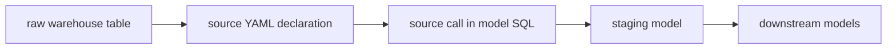

# `source()` and Source Definitions

<!-- toc:start -->
- [Why it matters](#why-it-matters)
- [Mental model](#mental-model)
- [Small example](#small-example)
- [Review notes](#review-notes)
- [Related notes](#related-notes)
- [Official references](#official-references)
<!-- toc:end -->

## Why it matters

`source()` is how dbt models reference raw source tables that are declared in YAML. It gives dbt a named source dependency, supports documentation and lineage, and compiles to the full database object name for the source table.

## Mental model



## Small example

```yaml
sources:
  - name: jaffle_shop
    database: raw
    schema: jaffle_shop
    tables:
      - name: customers
      - name: orders
```

```sql
select *
from {{ source('jaffle_shop', 'customers') }}
```

## Review notes

Use `source()` when the dependency is an externally managed/raw table. Use `ref()` when the dependency is another dbt-managed model, seed, or snapshot.

## Related notes

- [`ref()` and Model Dependencies](../models/ref.md)

## Official references

- [dbt docs: `source()` function](https://docs.getdbt.com/reference/dbt-jinja-functions/source)
- [dbt docs: sources guide](https://docs.getdbt.com/docs/build/sources)
